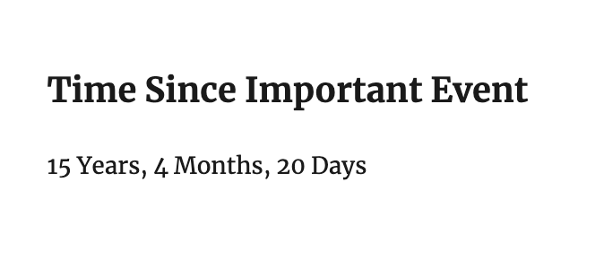

## Time Since 

A WordPress plugin that displays the years, months, and days since a specific date.

Values are passed into a shortcode which can be added to any page, post, or as a sidebar element.

### Example Usage

```
[time-since y=2006 m=07 d=01 title="Time Since Important Event"]
```

